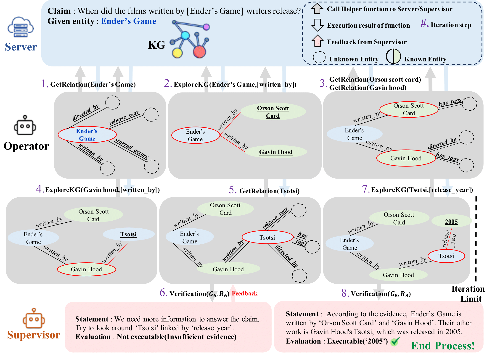

# R2-KG: General-Purpose Dual-Agent Framework for Reliable Reasoning on Knowledge Graphs
This repo provides the source code & data of our paper: [R2-KG: General-Purpose Dual-Agent Framework for Reliable Reasoning on Knowledge Graphs](https://arxiv.org/abs/2502.12767) (Arxiv 2025).

## The Pipeline of R2-KG

<p align="center">
      
</p>

## Requirements
- Required libraries for R2-KG can be found in `requirements.txt`.
```
pip install -r requirements.txt
```

- make .env file in the root directory and add the below line:
```
OPENAI_KEY = <YOUR_OPENAI_API_KEY>
```

## Prepare Dataset
### 0. Dataset
QA dataset and fact verification dataset used in R2-KG can be found in the below repos.
- [FactKG](https://github.com/jiho283/FactKG)
- [MetaQA](https://github.com/yuyuz/MetaQA)
- [WebQSP](https://www.microsoft.com/en-us/download/details.aspx?id=52763)
- [CRONQUESTIONS](https://github.com/apoorvumang/CronKGQA)

We've already included the proper dataset in each dataset directory (except CRONQUESTIONS, refer to below Knowledge Graphs Preparation for CRONQUESTIONS). Look `/[DATASET]/data` directory.

### 1. Knowledge Graphs (KGs) Preparation
Server has to provide the appropriate information requested by Opeartor. We used the SPARQL endpoint for triple-formed KGs (e.g., WebQSP, FactKG, MetaQA 3-hop). [jena-fuseki](https://github.com/stain/jena-docker?tab=readme-ov-file) provides a docker image and instructions for running the SPARQL endpoint server.

- [FactKG](https://github.com/jiho283/FactKG): [DBpedia 2015-10 version](https://downloads.dbpedia.org/2015-10/core-i18n/en/) is used as a KG for FactKG. However, there are files that are not relevant to solving FactKG. Also, to ensure a consistent URI format and make it more convenient to use, we have uploaded a preprocessed version of the files [here](https://drive.google.com/drive/folders/10P6nTTERQetfbmSidTfekIm60Hz3_2Dx?usp=drive_link). After that, use jena-fuseki to import the data into the SPARQL endpoint (use the names of the dataset mentioned in `./FactKG/dbpedia_sparql.py`). Finally, replace `[SPARQL SERVER URL]` with your database path (e.g., `http://111.222.333.444:port/`) in `./FactKG/dbpedia_sparql.py`.

- [MetaQA](https://github.com/yuyuz/MetaQA): For convenience, we also provide a preprocessed version of MetaQA KG [here](https://drive.google.com/drive/folders/1tbhIadnO4jPDQh98uGZ_vryD3ACSBKGp?usp=drive_link) (The URIs attached to this preprocessed file are provided for convenience and are not related to the actual data URIs). After that, use jena-fuseki to import the data into the SPARQL endpoint (use the names of dataset mentioned in `./MetaQA/movie_sparql.py`). Finally, replace `[SPARQL SERVER URL]` with your database path (e.g., `http://111.222.333.444:port/`) in `./MetaQA/movie_sparql.py`.

- [WebQSP](https://www.microsoft.com/en-us/download/details.aspx?id=52763): Although original [Freebase](https://developers.google.com/freebase) triples are available here, but [this repo](https://github.com/dki-lab/Freebase-Setup) helps setting up SPARQL endpoint for Freebase much easier. Follow the instructions in the repo (jena-fuseki is not needed here). Finally, replace `[SPARQL SERVER URL]` with your database path (e.g., `http://111.222.333.444:port/sparql`) in `./WebQSP/freebase_sparql.py`.

- [CRONQUESTIONS](https://github.com/apoorvumang/CronKGQA): You can get all dataset in linked repo. Since CRONQUESTIONS doesn't use a triple-form of KG, The preprocessing was done separately within the code. After downloading CRONQUESTIONS, move `/wikidata_big` directory into `./CRONQ/data` in this repo (create the `data` directory in `./CRONQ`).


## How to Run
### 1. Dual-Agent Mode R2-KG
To run R2-KG as a dual-agent mode (including Operator and Supervisor), employ the following command:
```sh
python r2kg_chatbot.py --dataset 'WebQSP' --operator 'gpt-4o-mini' --supervisor 'gpt-4o' --prompt 'pr_1' --iter_limit 15 --temperature 0.95 --top_p 0.95
```
This will generate a result file in `./[DATASET]/results/dual_agent/` directory.

The output file will be
- ```op_{OPERATOR}_sup_{SUPERVISOR}_{PROMPT}_temp_{TEMPERATURE}_topp_{TOP_P}.csv``` : Including only results for each dataset
- ```op_{OPERATOR}_sup_{SUPERVISOR}_{PROMPT}_temp_{TEMPERATURE}_topp_{TOP_P}.txt``` : Includes Operator's workflow

If you want to experiment with paraphrase mode, add `-paraphrase` option like below:
```sh
python r2kg_chatbot.py --dataset 'WebQSP' --operator 'gpt-4o-mini' --supervisor 'gpt-4o' --prompt 'pr_1' --iter_limit 15  --temperature 0.95 --top_p 0.95 -paraphrase
```
This will automatically generate three result files for each paraphrased sentence.

### 2. Single-Agent Mode R2-KG
To run R2-KG as a single-agent mode (excluding Supervisor), employ the following command:
```sh
python r2kg_chatbot.py --dataset 'WebQSP' --operator 'gpt-4o-mini' --prompt 'pr_1' --iter_limit 15 --temperature 0.95 --top_p 0.95 -single_agent 
```
This will generate a result file in `./[DATASET]/results/single_agent/` directory.

As mentioned, you can use `-paraphrase` option for additional experi1ments.

### 3. LLM models
We used [vllm](https://github.com/vllm-project/vllm) to serve other LLMs (open-source LLMs). To use your local LLMs, modify `[VLLM SERVER URL]` and related codes in `./model.py`.


## Evaluation
For evaluation, each dataset directory has `metric.py` file for metrics used for the evaluation. This file shows metric values ​​for a single file, and also the resulting metric values ​​when strict self-consistency is applied to multiple files. You can use the path of the file to be evaluated when running and the path of the file to be set as the result file as follows:
```sh
python metric.py [FILE_1] [FILE_2] [FILE_3] ... [FILE_N] [OUTPUTFILEPATH]
```

## Citation
You can cite us by:
```sh
@misc{jo2025r2kggeneralpurposedualagentframework,
      title={R2-KG: General-Purpose Dual-Agent Framework for Reliable Reasoning on Knowledge Graphs}, 
      author={Sumin Jo and Junseong Choi and Jiho Kim and Edward Choi},
      year={2025},
      eprint={2502.12767},
      archivePrefix={arXiv},
      primaryClass={cs.CL},
      url={https://arxiv.org/abs/2502.12767}, 
}
```