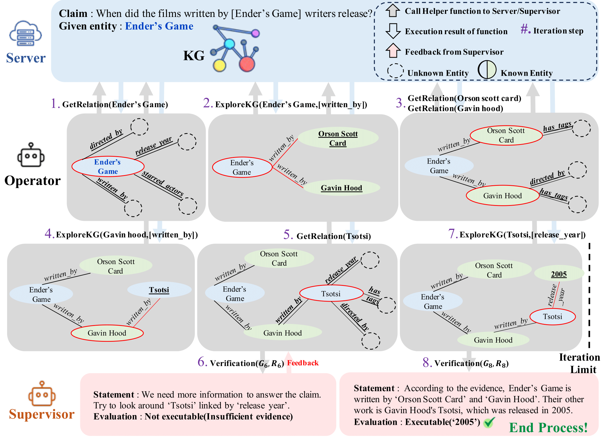

# R2-KG: General-Purpose Dual-Agent Framework for Reliable Reasoning on Knowledge Graphs
This repo provides the source code & data of our paper: [R2-KG: General-Purpose Dual-Agent Framework for Reliable Reasoning on Knowledge Graphs](https://arxiv.org/abs/2502.12767) (Arxiv 2025).

## The Pipeline of R2-KG

<p align="center">
      
</p>

## Requirements
- Required libraries for R2-KG can be found in `requirements.txt`.
```
pip install -r requirements.txt
```

- make .env file at root directory and add below line
```
OPENAI_KEY = <YOUR_OPENAI_API_KEY>
```

## Prepare Dataset
### 0. Dataset
QA dataset and fact verification dataset used in R2-KG can be found in below repos.
- [FactKG](https://github.com/jiho283/FactKG)
- [MetaQA](https://github.com/yuyuz/MetaQA)
- [WebQSP](https://www.microsoft.com/en-us/download/details.aspx?id=52763)
- [CRONQUESTIONS](https://github.com/apoorvumang/CronKGQA)


### 1. Knowledge Graphs (KGs)
Server has to provide appropriate information requested by Opeartor. We used SPARQL endpoint for triple-formed KGs (e.g., WebQSP, FactKG, MetaQA 3-hop). [jena-fuseki](https://github.com/stain/jena-docker?tab=readme-ov-file) provides docker image and instructions for running SPARQL endpoint server.

- [FactKG](https://github.com/jiho283/FactKG): [DBpedia 2015-10 version](https://downloads.dbpedia.org/2015-10/core-i18n/en/) is used as a KG for FactKG. However, there are files that are not relevant to solving FactKG. Also, to ensure a consistent URI format and make it more convenient to use, we have uploaded a preprocessed version of the files [here](). After then, use jena-fuseki to import the data into SPARQL endpoint.

- [MetaQA](https://github.com/yuyuz/MetaQA): For convenience, we also provide preprocessed version of MetaQA KG [here]() (The URIs attached to this preprocessed file are provided for convenience and are not related to the actual data URIs). After then, use jena-fuseki to import the data into SPARQL endpoint.

- [WebQSP](https://www.microsoft.com/en-us/download/details.aspx?id=52763): Although original [Freebase](https://developers.google.com/freebase) triples are available here, but [this repo](https://github.com/dki-lab/Freebase-Setup) helps setting up SPARQL endpoint for Freebase much easier. Follow the instructions in the repo (jena-fuseki is not needed here).

- [CRONQUESTIONS](https://github.com/apoorvumang/CronKGQA): You can get all dataset in linked repo. Since CRONQUESTIONS doesn't use triple-form of KG, The preprocessing was done separately within the code. 


## How to Run
### 


## Citation
You can cite us by:
```sh
@misc{jo2025r2kggeneralpurposedualagentframework,
      title={R2-KG: General-Purpose Dual-Agent Framework for Reliable Reasoning on Knowledge Graphs}, 
      author={Sumin Jo and Junseong Choi and Jiho Kim and Edward Choi},
      year={2025},
      eprint={2502.12767},
      archivePrefix={arXiv},
      primaryClass={cs.CL},
      url={https://arxiv.org/abs/2502.12767}, 
}
```


### VLLM Serving Code
- 대괄호가 씌워져 있는 parameter의 경우 상황에 따라 자주 바뀌기 때문에 상황에 맞게 parameter 수정 후 대괄호 제거 후 실행
```
CUDA_VISIBLE_DEVICES=[6,7] python -m vllm.entrypoints.openai.api_server --model meta-llama/Meta-Llama-3.1-8B-Instruct \
--load-format safetensors --max-model-len 8192 --download-dir /nfs_data_storage/huggingface \
--tensor-parallel-size [2] --port [8043] --dtype bfloat16 --chat-template ./tool_chat_template_llama3.1_json.jinja
```
- 실행 시 "http://server_url:server_port/v1" url로 요청 가능
- test code : /model.py
